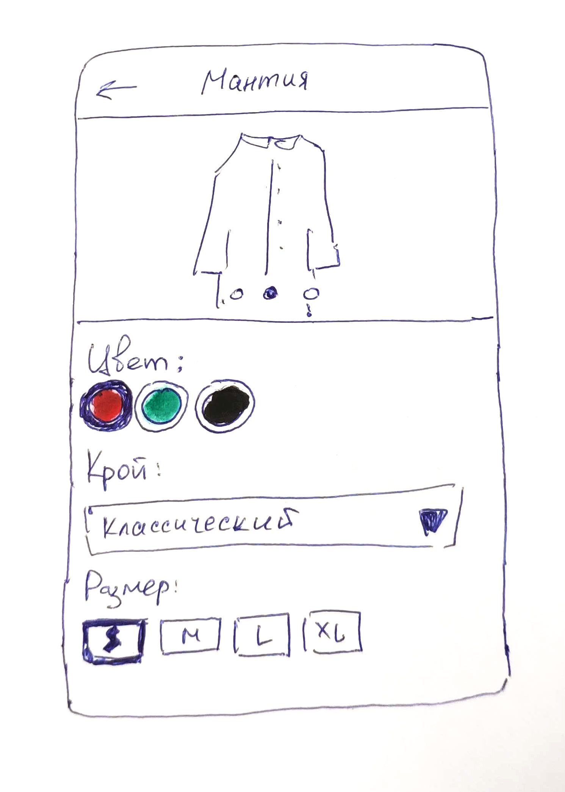

# Структура данных для товаров в интернет-магазине

## Введение

Как правило, один и тот же товар в магазине может иметь несколько разновидностей.

Вещи в магазине одежды продаются разных цветов и размеров. Ноутбуки продаются в разных модификациях, которые отличаются размером оперативной памяти, размером SSD, моделью видеокарты и т.д. Назовем эти особенности **опциями**.

Каждая опция имеет свои собственные **значения**. Например, у опции "Цвет" могут быть значения "Красный", "Зеленый", "Синий". У опции "Размер" - значения "S", "M", "L".

Набор конкретных значений всех опций товара назовём **вариантом** товара. У товара может быть столько вариантов, сколько существует возможных комбинаций из всех значений всех его опций. Например, если у товара "Футболка" есть две опции - "Цвет" и "Размер" с описанными выше значениями, то возможны такие варианты:

- Красная S
- Красная M
- Красная L
- Зеленая S
- Зеленая M
- Зеленая L
- Синяя S
- Синяя M
- Синяя L

Кроме опций у товара могут быть характеристики, не участвующие в формировании вариантов. Назовём их **свойствами**. Например, "Производитель" и "Крой" у футболки всегда строго определенные. Если у свойства "Крой" могут быть **значения** "Классический", "Полуприлегающий" и "Приталенный", то футболка может иметь только один из этих кроев.

Со временем магазин может начать торговать новыми типами товаров с ранее неизвестными опциями и свойствами. Например, если в продаже появились штаны, то могут потребоваться опции "Длина" и "Обхват талии".

При разработке интернет-магазина важно спроектировать такие структуру данных и клиент-серверное взаимодействие, чтобы:
- Разные товары могли иметь разный набор опций и свойств.
- Появление новых товаров, опций, значений опций, свойств и значений свойств не приводили к дополнительному программированию.

## Опции и значения опций

Чтобы иметь возможность добавлять новые опции без программирования, следует завести две таблицы - "Опции" и "Значения опций". Они должны находиться на уровне всего магазина, а не на уровне конкретного товара. Создать опцию и её значения придется единожды, а в рамках товаров оперировать лишь идентификаторами.

Как для опций, так и для их значений, понадобится следующий набор полей:
- Представление. Это название, которое будет показываться в интерфейсе пользователя.
- Системное название, по которому можно идентифицировать опцию или значение на программном уровне. Это полезно в случаях, когда для определенных опций или их значений нужно запрограммировать особый пользовательский интерфейс.

Пример, как форма для выбора значений опций товара может выглядеть в мобильном приложении:



Учитывая требования, можно создать следующие таблицы.

Опции:

```sql
CREATE TABLE options
(
  id bigserial PRIMARY KEY, -- Идентификатор опции
  code character varying, -- Системное название опции, например, "color"
  name character varying -- Название опции для пользователя, например, "Цвет"
);
```

Заводить несколько одинаковых опций не имеет смысла, поэтому нужно создать уникальный индекс по полю `code`:

```sql
CREATE UNIQUE INDEX index_options_on_code
  ON options
  (code);
```

Значения опций:

```sql
CREATE TABLE option_values
(
  id bigserial PRIMARY KEY, -- Идентификатор значения опции
  code character varying, -- Системное название значения, например "xl" или "red"
  name character varying, -- Название значения для пользователя, например,"XL" или "Красный"
  option_id bigint -- Идентификатор опции, которому принадлежит значение
);
```

Заводить несколько одинаковых значений в рамках одной опции тоже не имеет смысла, поэтому нужно создать уникальный индекс по двум полям - `option_id`, `code`. Если поставить поле `option_id` на первое место, то индекс будет выполнять сразу две функции:
- Контроль уникальности по двум полям
- Оптимизация выборки значений для конкретных опций

```sql
CREATE UNIQUE INDEX index_option_values_on_option_id_and_code
  ON option_values
  (option_id, code);
```

Структура данных для сериализации в JSON:

```java
public class Option {
  private Long id;
  private String code;
  private String name;
  private List<OptionValue> values;
}

public class OptionValue {
  private Long id;
  private String code;
  private String name;
}
```

Пример выдачи на клиент опций и всех возможных значений этих опций:

```json
{
  "options": [
    {
      "id": 1,
      "code": "color",
      "name": "Цвет",
      "values": [
        {
          "id": 1,
          "code": "red",
          "name": "Красный"
        },
        {
          "id": 2,
          "code": "green",
          "name": "Зеленый"
        },
        {
          "id": 3,
          "code": "blue",
          "name": "Синий"
        }
      ]
    },
    {
      "id": 2,
      "code": "size",
      "name": "Размер",
      "values": [
        {
          "id": 4,
          "code": "s",
          "name": "S"
        },
        {
          "id": 5,
          "code": "m",
          "name": "M"
        },
        {
          "id": 6,
          "code": "l",
          "name": "L"
        },
        {
          "id": 7,
          "code": "xl",
          "name": "XL"
        }
      ]
    },
    {
      "id": 3,
      "code": "material",
      "name": "Материал",
      "values": [
        {
          "id": 8,
          "code": "cotton",
          "name": "Хлопок"
        },
        {
          "id": 9,
          "code": "viscose",
          "name": "Вискоза"
        }
      ]
    }
  ]
}
```

Стоит обратить внимание, что идентификаторы значений опций не будут повторяться даже между разными опциями, так как все значения для всех опций хранятся в одной таблице.

## Дополнительная информация о значениях опций

Перечисленного набора полей у значений опций может не хватить из-за специфичной бизнес-логики или пользовательского интерфейса. Например, для цветов понадобится хранить шестнадцатеричный код.

Поля, специфичные для конкретной опции, не нужно добавлять в таблицу значений опций, так как со временем она может превратиться в свалку полей.

Для этих целей заведите специальную таблицу мета-информации для значений опций:

```sql
CREATE TABLE option_value_metas
(
  id bigserial PRIMARY KEY, -- Идентификатор меты
  code character varying, -- Название меты, например, "hex"
  value character varying, -- Значение меты, например, "#ff0000"
  option_value_id bigint -- Идентификатор значения, которому принадлежит мета
);
```

Хранить несколько одинаковых мет для одного значения опций не имеет смысла, поэтому нужно завести уникальный индекс по двум полям - `option_value_id`, `code`. Если поставить поле `option_value_id` на первое место, то индекс будет выполнять сразу две функции:
- Контроль уникальности по двум полям
- Оптимизация выборки мет для конкретных значений опций

```sql
CREATE UNIQUE INDEX index_option_value_metas_on_option_value_id_and_code
  ON option_value_metas
  (option_value_id, code);
```

Структура данных для сериализации в JSON:

```java
public class OptionValue {
  private Long id;
  private String code;
  private String name;
  private List<OptionValueMeta> metas;
}

public class OptionValueMeta {
  private Long id;
  private String code;
  private String value;
}
```

Теперь к значениям опций можно прикреплять различную информацию. Например, если для цвета "Красный" нужно добавить шестнадцатиричный код, сохраните в базу данных соответствующую мету:

```json
{
  "id": 1,
  "code": "red",
  "name": "Красный",
  "metas": [
    {
      "id": 1,
      "code": "hex",
      "value": "#ff0000"
    }
  ]
}
```

## Свойства и значения свойств

Чтобы иметь возможность добавлять новые свойства без программирования, следует завести две таблицы - "Свойства" и "Значения свойств". По структуре они аналогичны опциям и значениям опций.

Свойства:

```sql
CREATE TABLE properties
(
  id bigserial PRIMARY KEY, -- Идентификатор свойства
  code character varying, -- Системное название свойства, например, "fit"
  name character varying -- Название свойства для пользователя, например, "Крой"
);
```

Заводить несколько одинаковых свойств не имеет смысла, поэтому нужно создать уникальный индекс по полю `code`:

```sql
CREATE UNIQUE INDEX index_properties_on_code
  ON properties
  (code);
```

Значения свойств:

```sql
CREATE TABLE property_values
(
  id bigserial PRIMARY KEY, -- Идентификатор значения свойства
  code character varying, -- Системное название значения, например "classic"
  name character varying, -- Название значения для пользователя, например,"Классический"
  property_id bigint -- Идентификатор свойства, которому принадлежит значение
);
```

Заводить несколько одинаковых значений в рамках одного свойства тоже не имеет смысла, поэтому нужно создать уникальный индекс по двум полям - `property_id`, `code`. Если поставить поле `property_id` на первое место, то индекс будет выполнять сразу две функции:
- Контроль уникальности по двум полям
- Оптимизация выборки значений для конкретных свойств

```sql
CREATE UNIQUE INDEX index_property_values_on_property_id_and_code
  ON property_values
  (property_id, code);
```

Структура данных для сериализации в JSON:

```java
public class Property {
  private Long id;
  private String code;
  private String name;
  private List<PropertyValue> values;
}

public class PropertyValue {
  private Long id;
  private String code;
  private String name;
}
```

Пример выдачи на клиент свойств и всех возможных значений этих свойств:

```json
{
  "properties": [
    {
      "id": 1,
      "code": "fit",
      "name": "Крой",
      "values": [
        {
          "id": 1,
          "code": "classic",
          "name": "Классический"
        },
        {
          "id": 2,
          "code": "slim",
          "name": "Полуприлегающий"
        },
        {
          "id": 3,
          "code": "regular",
          "name": "Приталенный"
        }
      ]
    },
    {
      "id": 2,
      "code": "manufacturer",
      "name": "Производитель",
      "values": [
        {
          "id": 4,
          "code": "cotton_plus",
          "name": "Хлопок Плюс"
        },
        {
          "id": 5,
          "code": "natural_fabrics",
          "name": "ООО Натуральные Ткани"
        }
      ]
    }
  ]
}
```

Стоит обратить внимание, что идентификаторы значений свойств не будут повторяться даже между разными свойствами, так как все значения для всех свойств хранятся в одной таблице.

## Товары и варианты

Разные товары могут обладать разным набором опций. Например, опциями футболок могут быть "Цвет" и "Размер", а опциями шкафов - "Ширина", "Высота", "Глубина". Набор конкретных значений всех опций товара описывается вариантом товара, например, "Футболка Синяя XL".

Бывают ситуации, когда цена у разных вариантов одного и того же товара отличается.

Не все значения определенной опции могут быть актуальны для определенного товара. Например, в справочнике цветов могут быть цвета "Красный", "Зеленый" и "Синий", а определенная футболка продается только "Красного" и "Зеленого" цветов.

Ещё, у товаров есть свойства, которые не участвуют в формировании вариантов.

Учитывая описанное выше, можно создать следующий набор таблиц.

Товары:

```sql
CREATE TABLE products (
  id bigserial PRIMARY KEY, -- Идентификатор товара
  name character varying -- Название товара
);
```

Опции, доступные для товара:

```sql
CREATE TABLE product_options (
  id bigserial PRIMARY KEY, -- Идентификатор опции товара
  product_id bigint, -- Идентификатор товара
  option_id bigint -- Идентификатор опции
);
```

Так как у одного товара не должно быть двух одинаковых опций, необходимо создать индекс на уникальность по двум полям - `product_id`, `option_id`. Если поставить поле `product_id` на первое место, то индекс будет выполнять сразу две функции:
- Контроль уникальности по двум полям
- Оптимизация выборки опций для конкретных товаров

```sql
CREATE UNIQUE INDEX index_product_options_on_product_id_and_option_id
  ON product_options
  (product_id, option_id);
```

Варианты:

```sql
CREATE TABLE variants (
  id bigserial PRIMARY KEY, -- Идентификатор варианта
  name character varying, -- Название варианта
  product_id bigint, -- Идентификатор товара, которому принадлежит вариант
  price numeric(8, 2) -- Цена варианта
);
```

Для оптимизации выборки вариантов для конкретных товаров необходимо создать индекс по полю `product_id`:

```sql
CREATE INDEX index_variants_on_product_id
  ON variants
  (product_id);
```

Значения опций конкретного варианта:

```sql
CREATE TABLE variant_option_values (
  id bigserial PRIMARY KEY, -- Идентификатор значения опции в варианте
  variant_id bigint, -- Идентификатор варианта, которому принадлежит значение
  option_value_id bigint -- Идентификатор значения опции
)
```

Так как у одного варианта не должно быть двух одинаковых значений опций, необходимо создать индекс на уникальность по двум полям - `variant_id`, `option_value_id`. Если поставить поле `variant_id` на первое место, то индекс будет выполнять сразу две функции:
- Контроль уникальности по двум полям
- Оптимизация выборки значений опций для конкретных вариантов

Свойства товара:

```sql
CREATE TABLE product_properties
(
  id bigserial PRIMARY KEY, -- Идентификатор свойства товара
  product_id bigint, -- Идентификатор товара, которому принадлежит свойство
  property_id bigint -- Идентификатор свойств
)
```

Так как у одного товара не должно быть двух одинаковых свойств, необходимо создать индекс на уникальность по двум полям - `product_id`, `property_id`. Если поставить поле `product_id` на первое место, то индекс будет выполнять сразу две функции:
- Контроль уникальности по двум полям
- Оптимизация выборки свойств для конкретных товаров

```sql
CREATE UNIQUE INDEX index_product_properties_on_product_id_and_property_id
  ON product_properties
  (product_id, property_id);
```

Значения свойств товара:

```sql
CREATE TABLE product_property_values
(
  id bigserial PRIMARY KEY, -- Идентификатор значения свойства товара
  product_id bigint, -- Идентификатор товара, которому принадлежит значение свойства товара
  property_value_id bigint -- Идентификатор значения свойства
)
```

Так как у одного товара не должно быть двух одинаковых значений свойств, необходимо создать индекс на уникальность по двум полям - `product_id`, `property_value_id`. Если поставить поле `product_id` на первое место, то индекс будет выполнять сразу две функции:
- Контроль уникальности по двум полям
- Оптимизация выборки значений свойств для конкретных товаров

```sql
CREATE UNIQUE INDEX index_product_prop_values_on_product_id_and_prop_value_id
  ON product_property_values
  (product_id, property_value_id);
```

Структура данных для сериализации в JSON:

```java
public class Product {
  private Long id;
  private String name;
  private List<PropertyValue> propertyValues;
  private List<Option> options;
  private List<Variant> variants;
}

public class PropertyValue {
  private Long id;
  private String code;
  private String name;
  private Property property;
}

public class Property {
  private Long id;
  private String code;
  private String name;
}

public class Option {
  private Long id;
  private String code;
  private String name;
  private List<OptionValue> values;
}

public class OptionValue {
  private Long id;
  private String code;
  private String name;
}

public class Variant {
  private Long id;
  private String name;
  private VariantPrice price;
  private Map<String, Long> optionValueIdByOptionCode;
}

public class VariantPrice {
  private BigDecimal amount;
}
```

Пример выдачи полной информации о товаре и его вариантах в API:

```json
{
  "product": {
    "id": 1,
    "name": "Футболка",
    "propertyValues": [
      {
        "id": 1,
        "code": "classic",
        "name": "Классический",
        "property": {
          "id": 1,
          "code": "fit",
          "name": "Крой"
        }
      },
      {
        "id": 5,
        "code": "natural_fabrics",
        "name": "ООО Натуральные Ткани",
        "property": {
          "id": 2,
          "code": "manufacturer",
          "name": "Производитель"
        }
      }
    ],
    "options": [
      {
        "id": 1,
        "code": "color",
        "name": "Цвет",
        "values": [
          {
            "id": 1,
            "code": "red",
            "name": "Красный"
          },
          {
            "id": 2,
            "code": "green",
            "name": "Зеленый"
          }
        ]
      },
      {
        "id": 2,
        "code": "size",
        "name": "Размер",
        "values": [
          {
            "id": 4,
            "code": "s",
            "name": "S"
          },
          {
            "id": 5,
            "code": "m",
            "name": "M"
          }
        ]
      }
    ],
    "variants": [
      {
        "id": 1,
        "name": "Футболка Красная S",
        "price": {
          "amount": "900.00"
        },
        "optionValueIdByOptionCode": {
          "color": 1,
          "size": 4
        }
      },
      {
        "id": 2,
        "name": "Футболка Красная M",
        "price": {
          "amount": "950.00"
        },
        "optionValueIdByOptionCode": {
          "color": 1,
          "size": 5
        }
      },
      {
        "id": 3,
        "name": "Футболка Зеленая M",
        "price": {
          "amount": "950.00"
        },
        "optionValueIdByOptionCode": {
          "color": 2,
          "size": 5
        }
      }
    ]
  }
}
```

Цена выгружена отдельным объектом, а не одним полем, так как с течением времени может понадобиться дополнительная информация о цене. Например, валюта или отформатированное значение.

Идентификаторы значений опций не могут повторяться даже между разными опциями. Если цвет "Красный" имеет идентификатор 1, то никакого размера с идентификатором 1 уже быть не может.

Одно и то же значение опции может находиться в нескольких разных вариантах. Чтобы клиент мог оперировать уникальными списками опций и их значений, они выданы параллельно с вариантами, а не внутри.

Как правило, на экране товара отображается список полей, которые пользователь должен последовательно заполнить для выбора варианта. По одному полю на каждую опцию.

Так как в товаре может не быть варианта с каким-то конкретным набором значений опций, например, варианта "Футболка Синяя S", то возможные значения каждого поля должны быть отфильтрованы по следующему алгоритму:
1. Найти все варианты товара, содержащие выбранные значения опций из всех предыдущих полей.
2. Из каждого полученного варианта взять значение той опции, которая соответствует текущему полю.
3. Из полученных значений опций взять уникальные.

Рассмотрим форму с опциями "Цвет", "Размер", "Материал", в которой уже заполнены поля "Цвет" и "Размер" значениями "Красный" и "M" соответственно, а поле "Материал" еще не заполнено. Чтобы отобразить возможные для выбора материалы, необходимо:
1. Найти все "Красные M" варианты.
2. Из полученных "Красных M" вариантов взять материал.
3. Из полученных материалов взять только уникальные.

## Корзина

Так как клиент покупает конкретный вариант товара, то именно вариант нужно добавлять в корзину, а не товар. Более подробно корзина описана [здесь](./cart.md).

## Товары без опций

Магазин может торговать товарами без опций, у которых не будет разных вариантов. Например, стульями, у которых нет доступных для выбора характеристик - ни разных цветов, ни разных размеров. Просто стул. Такая концепция конфликтует с идеей, что в корзину добавляется вариант, а не товар.

Для таких товаров все равно необходимо создать вариант в базе данных, один единственный, без значений опций. В нём будут храниться данные, которых не хватает в таблице товаров. Такой вариант пригодится и для тех товаров, у которых есть опции. Назовём его **главным вариантом**. В базе данных необходимо завести для него соответствующий индикатор:

```sql
ALTER TABLE variants
ADD COLUMN is_main boolean;
```

Главный вариант должен присутствовать у любого товара. Если у товара нет опций, то в корзину добавляется главный вариант. Если у товара есть опции, то в корзину добавляется конкретный вариант, а главный вариант используется для следующих целей:
- Как шаблон для создания новых вариантов, из которого можно брать значения для предзаполнения полей. Например, в панели управления администратора при создании нового варианта.
- Как набор значений по умолчанию для пользовательского интерфейса, где еще не выбран конкретный вариант товара. Например, при отображении цены в списке товаров.

Таким образом, структуру товара в API можно расширить, выдав главный вариант параллельно с остальными и исключив его из общего списка вариантов.

```java
public class Product {
  private Long id;
  private String name;
  private List<PropertyValues> propertyValues;
  private List<Option> options;
  private Variant mainVariant;
  private List<Variant> variants;
}
```

## Цены в разных валютах

Если планируется продажа товаров в разных валютах, то имеет смысл завести отдельную таблицу цен на варианты, в которой будет хранится соответствие цены и валюты для каждого варианта:

```sql
CREATE TABLE variant_prices
(
  id bigserial PRIMARY KEY, -- Идентификатор цены на вариант
  amount numeric(8, 2), -- Сумма
  currency_code character varying, -- Код валюты
  variant_id bigint -- Идентификатор варианта, которому принадлежит цена
);
```

Так как у одного варианта не должно быть двух одинаковых валют, необходимо создать индекс на уникальность по двум полям - `variant_id`, `currency`. Если поставить поле `variant_id` на первое место, то индекс будет выполнять сразу две функции:
- Контроль уникальности по двум полям
- Оптимизация выборки цен для конкретных вариантов

```sql
CREATE UNIQUE INDEX index_variant_prices_on_variant_id_and_currency_code
  ON variant_prices
  (variant_id, currency_code);
```

Клиентской стороне не обязательно знать информацию о всех валютах. Достаточно дать пользователю выбрать валюту один раз для всего магазина, глобальной настройкой, а в информации о товарах выдавать одну цену в выбранной валюте. Выбранную валюту можно сохранить в корзине пользователя. Таким образом, в истории заказов будет храниться информация о том, в какой именно валюте был совершен заказ. При добавлении товара в корзину необходимо создавать позицию корзины в выбранной валюте, а при смене корзины - пересчитать цены.

## Дальнейшие доработки

В ходе разработки может оказаться, что описанной выше структуры данных не достаточно для определенных задач. Например, понадобится отображать для товаров текстовые описания или изображения.

Перед тем, как доработать структуру, подумайте, может ли эта информация отличаться между разными вариантами одного товара. Например, для разных цветов товара можно показывать разные изображения.

Если для разных вариантов могут понадобиться разные значения, расширяйте таблицу вариантов.
